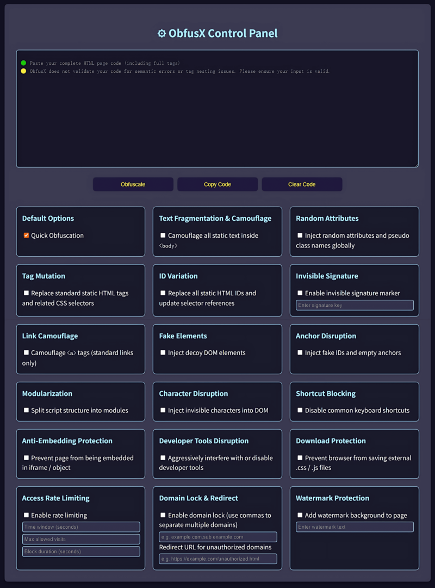
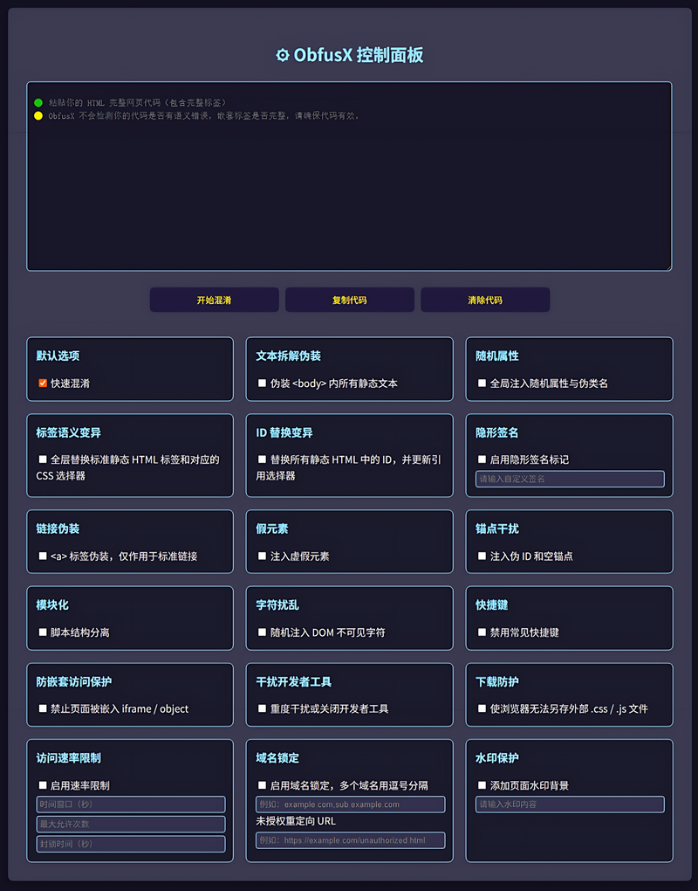

# ObfusX

**Brutal HTML obfuscation. One click. Zero dependencies. Pure JavaScript.**

ObfusX 是一个纯 JavaScript 实现的 HTML 混淆工具，零依赖、零构建，支持一键混淆，专为前端源码保护而设计。

---

## 🔐 Features / 功能特点

### Structural Protection / 结构层防护
- Tag Mutation / 标签语义变异
- Text Fragmentation / 文本拆解伪装
- ID Mutation / ID 替换扰乱
- Invisible Signature / 隐形原创标识
- Character Noise / 字符扰乱
- Random Attributes / 随机属性注入
- Link Cloaking / 链接伪装
- Fake Elements / 假元素干扰
- Anchor Disruption / 锚点干扰
- Script Shuffling / 脚本结构打乱

### Behavioral Protection / 行为层防护
- Shortcut Blocking / 快捷键屏蔽
- Anti-iframe / 防嵌套访问
- DevTools Disruption / 干扰开发者工具
- Download Prevention / 下载防护
- Rate Limiting / 访问速率限制
- Domain Lock / 域名锁定与跳转
- Watermark Injection / 水印保护

🔗 [Live Demo / 在线演示](https://obfusx.toolxp.com)

### 🧪 Tool Interface (English)

### 🧪 工具界面（中文）

